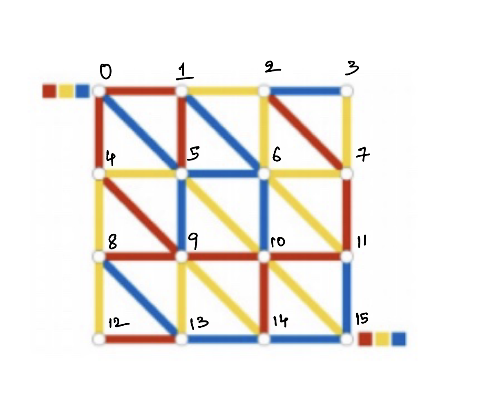

# Colorful-Maze

This Python code is an implementation of the Breadth-First Search (BFS) algorithm on a tri-colored graph. The graph has nodes connected by edges of three different colors: red, yellow, and blue. The code finds the shortest path from a given source node `s` to a target node `t` such that the path starts with a red edge, ends with a blue edge, and follows a specific color order: red → yellow → blue in a cyclic manner.

## Usage

The main function of the code is `bfs_modified(graph, s, t)`, which takes three inputs:
- `graph`: A tuple containing three dictionaries (one for each color) and total number of nodes.
- `s`: The source node.
- `t`: The target node.

To use the code, simply import the `bfs_modified` function and call it with the desired input graph, source node, and target node.

## Time complexity
The time complexity of the BFS algorithm on a tri-colored graph is O(3N + E), where N is the number of nodes and E is the total number of edges in the graph. This is because each node can atmost be visted 3 times(once for each color) and each edge is visited at most once during the traversal.

## Example graph

### Sample output
**path**: 0--red--> 4--yellow--> 5--blue--> 9--red--> 10--yellow--> 15--blue--> 11--red--> 7--yellow--> 6--blue--> 10--red--> 9--yellow--> 14--blue--> 15

*test.ipynb* contains the sample code for the above graph.

